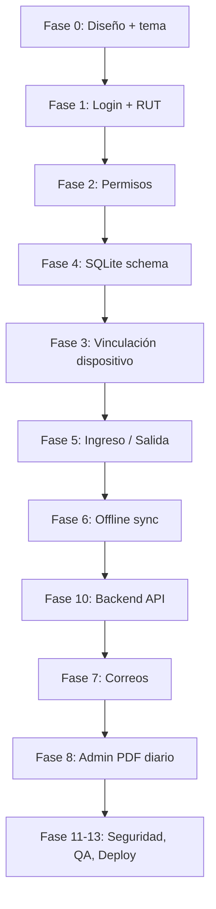

# Todo List — Mi Asistencia App

> Aplicación móvil (Expo SDK 56) para registro de asistencia de colaboradores en ruta (visitas a supermercados en Chile).  
> Referencia visual: template TeamHub — paleta mint/teal, cards, tipografía sans-serif, estados con color semántico.

---

## Leyenda

| Símbolo | Significado |
|---------|-------------|
| `[ ]` | Pendiente |
| `[~]` | En progreso |
| `[x]` | Completado |
| `🔒` | Requisito de seguridad / trazabilidad |
| `📴` | Soporte offline |
| `📧` | Notificación por correo |

---

## Fase 0 — Fundamentos del proyecto

- [ ] Definir arquitectura: `src/` (app móvil) + `database/` (SQLite local) + backend/API (sincronización, correos, PDF)
- [ ] Configurar sistema de diseño basado en TeamHub:
  - [ ] Paleta primaria mint/teal (`#2DD4A8` / `#14B8A6` — ajustar sobre template)
  - [ ] Fondos: blanco puro (cards) + gris muy claro (`#F5F7FA`) para pantalla
  - [ ] Tipografía: Inter o similar (pesos 400/500/600/700)
  - [ ] Tokens semánticos: `success`, `warning`, `error`, `info`, `neutral`
  - [ ] Componentes base: `Card`, `Button`, `Badge`, `AlertBanner`, `ProgressRing`, `Input`, `Toast`
- [ ] Actualizar `src/constants/theme.ts` con la paleta definitiva
- [ ] Configurar variables de entorno (API URL, SMTP, claves) sin commitear secretos
- [ ] Documentar flujo de permisos nativos requeridos en `app.json` plugins

---

## Fase 1 — Autenticación e ingreso a la app

### 1.1 Pantalla de Login

- [ ] UI de login con estética TeamHub (card centrada, logo, inputs limpios)
- [ ] Campo **RUT chileno** con:
  - [ ] Formato automático (`12.345.678-9`)
  - [ ] Validación de dígito verificador (módulo 11)
  - [ ] Mensajes de error claros (UX)
- [ ] Campo **últimos 4 dígitos** (máscara numérica, actúa como contraseña)
- [ ] Botón **Ingresar** con estado loading y feedback visual
- [ ] Opción **Ingresar con huella / Face ID** (si biometría ya fue habilitada previamente) 🔒
- [ ] Persistencia segura de sesión (`expo-secure-store`)

### 1.2 Biometría (optativa post-login)

- [ ] Pantalla de onboarding: "¿Deseas habilitar huella o Face ID?"
- [ ] Integrar `expo-local-authentication`
- [ ] Guardar preferencia del usuario en SQLite (`user_preferences`)
- [ ] Flujo: RUT + 4 dígitos **o** biometría (si ya configurada)

### 1.3 Trazabilidad de inicio de sesión 🔒

- [ ] Al autenticar exitosamente, capturar y almacenar:
  - [ ] Fecha y hora local del dispositivo (ISO 8601 + timezone)
  - [ ] IP pública (vía API o servicio)
  - [ ] Geolocalización (lat, long, precisión en metros)
  - [ ] Usuario (RUT)
  - [ ] Foto del usuario (debe mostrar su cara en la cámara la cual será capturada)
  - [ ] Marca, modelo, OS y versión del dispositivo (`expo-device`)
  - [ ] Identificadores: IMEI/serial (según plataforma y permisos)
  - [ ] ID de sesión único (UUID)
- [ ] Registrar evento en SQLite (`login_events`)
- [ ] Encolar para sincronización si no hay red 📴
- [ ] Enviar correo de confirmación de inicio de sesión 📧

---

## Fase 2 — Permisos obligatorios del dispositivo

### 2.1 Flujo de permisos (post-login, pre-home)

- [ ] Pantalla secuencial de permisos con explicación clara del *por qué* (UX)
- [ ] **Cámara** (`expo-camera`) — uso de seguridad / evidencia en registro
- [ ] **Geolocalización exacta** (`expo-location`) — foreground + background si aplica
- [ ] **Biometría** — optativa, no bloquear flujo principal
- [ ] Estado visual por permiso: concedido / denegado / pendiente (badges de color)
- [ ] Si permiso crítico denegado → banner de advertencia persistente + guía para habilitar en ajustes

### 2.2 Validación de permisos en runtime

- [ ] Verificar permisos antes de cada registro de Ingreso/Salida
- [ ] Bloquear registro si falta cámara o geolocalización (con mensaje accionable)

---

## Fase 3 — Vinculación de dispositivo (1 usuario = 1 dispositivo) 🔒

### 3.1 Registro del dispositivo

- [ ] Al primer login exitoso, registrar dispositivo en backend y SQLite (`linked_devices`):
  - [ ] N° teléfono
  - [ ] Serial
  - [ ] IMEI (Android) / identifierForVendor (iOS)
  - [ ] Marca y modelo
  - [ ] OS y versión
  - [ ] Fecha de vinculación
- [ ] Marcar dispositivo como **activo** para el usuario

### 3.2 Detección de segundo dispositivo

- [ ] Al login desde dispositivo no vinculado:
  - [ ] Bloquear acceso a registro de asistencia
  - [ ] Mostrar pantalla **"Dispositivo no vinculado"** (alerta de alto contraste, estilo warning)
  - [ ] Enviar **correo de alerta único** al usuario (solo la primera vez por intento) 📧
- [ ] Flujo de gestión de vinculación:
  - [ ] Usuario confirma dar de baja dispositivo anterior
  - [ ] Habilitar nuevo dispositivo con todos sus metadatos
  - [ ] Registrar auditoría del cambio (`device_link_audit`)
- [ ] Admin/supervisor puede forzar desvinculación desde panel (futuro)

---

## Fase 4 — Modelo de datos SQLite (`database/`)

### 4.1 Estructura de carpetas

```
database/
├── schema.sql          # DDL inicial
├── migrations/         # Versionado de esquema
└── mi-asistencia.db    # Archivo SQLite (gitignored)
```

### 4.2 Tablas principales

- [ ] `users` — RUT, nombre, email, rol (`colaborador` | `supervisor` | `admin`), supermercados asignados
- [ ] `supermarkets` — id, nombre, comuna, dirección, lat, long, radio_geofence_m
- [ ] `user_supermarkets` — relación N:M colaborador ↔ supermercados
- [ ] `linked_devices` — dispositivo vinculado por usuario
- [ ] `device_link_audit` — historial de cambios de dispositivo
- [ ] `attendance_events` — registros de Ingreso/Salida 📴
- [ ] `login_events` — trazabilidad de sesiones
- [ ] `sync_queue` — cola de eventos pendientes de envío al servidor 📴
- [ ] `user_preferences` — biometría habilitada, tema, etc.

### 4.3 Campos de trazabilidad en `attendance_events` 🔒

| Campo | Descripción |
|-------|-------------|
| `id` | UUID local |
| `user_rut` | RUT del colaborador |
| `supermarket_id` | Supermercado visitado |
| `event_type` | `INGRESO` \| `SALIDA` |
| `recorded_at_local` | Fecha/hora **local** del dispositivo al momento del registro (inmutable) |
| `timezone` | Zona horaria IANA |
| `latitude` / `longitude` | Coordenadas GPS |
| `location_accuracy_m` | Precisión en metros |
| `ip_address` | IP al sincronizar |
| `device_brand` | Marca |
| `device_model` | Modelo |
| `device_os` | Sistema operativo |
| `device_serial` | Serial / identifier |
| `photo_uri` | Ruta local de foto de evidencia (cámara) |
| `sync_status` | `pending` \| `synced` \| `failed` |
| `synced_at` | Fecha de sincronización exitosa |
| `server_id` | ID remoto post-sync |
| `created_at` | Timestamp de creación del registro local |

### 4.4 Integración SQLite en Expo

- [ ] Usar `expo-sqlite` (SDK 56)
- [ ] Capa de repositorio: `src/database/` (queries tipadas, transacciones)
- [ ] Migraciones automáticas al iniciar la app
- [ ] Índices en `user_rut`, `recorded_at_local`, `sync_status` (performance)

---

## Fase 5 — Registro de asistencia (Ingreso / Salida)

### 5.1 Home del colaborador

- [ ] Dashboard estilo TeamHub:
  - [ ] Card de perfil (nombre, RUT, estado del día)
  - [ ] Lista de supermercados asignados (cards con comuna y dirección)
  - [ ] Indicador de visita activa (Ingreso sin Salida pendiente)
  - [ ] Badge de estado de red: online / offline / sincronizando 📴
  - [ ] Historial reciente del día (timeline)

### 5.2 Flujo de Ingreso

- [ ] Colaborador selecciona supermercado
- [ ] Validaciones previas:
  - [ ] Dispositivo vinculado y activo 🔒
  - [ ] Permisos de cámara y GPS concedidos
  - [ ] No existe Ingreso abierto en otro supermercado (o regla de negocio definida)
  - [ ] Geofence: distancia al supermercado ≤ radio configurado (opcional pero recomendado)
- [ ] Captura de foto con cámara frontal/trasera (evidencia)
- [ ] Captura de geolocalización exacta en el momento del tap
- [ ] Confirmación visual (modal / toast success)
- [ ] Guardar en SQLite con `sync_status: pending` 📴
- [ ] Encolar en `sync_queue`
- [ ] Intentar sync inmediato si hay red

### 5.3 Flujo de Salida

- [ ] Mismo flujo que Ingreso, vinculado al Ingreso abierto del supermercado
- [ ] Validar que exista Ingreso previo sin Salida
- [ ] Calcular duración de visita (para UI y reportes)
- [ ] Guardar con misma trazabilidad 🔒
- [ ] Enviar correo de salida al colaborador 📧 (detalle abajo)

### 5.4 Buenas prácticas de trazabilidad 🔒

- [ ] **Nunca** sobrescribir `recorded_at_local` al sincronizar
- [ ] Hash de integridad del payload (SHA-256) antes de enviar
- [ ] Log de intentos de sync fallidos con motivo
- [ ] Foto comprimida pero legible (balance calidad/tamaño)
- [ ] Rechazar registros con GPS mock detectado (si plataforma lo permite)

---

## Fase 6 — Modo offline y sincronización 📴

- [ ] Detector de conectividad (`@react-native-community/netinfo` o equivalente Expo 56)
- [ ] Registro de Ingreso/Salida **siempre permitido** sin internet
- [ ] Cola persistente en `sync_queue` (FIFO, reintentos exponenciales)
- [ ] Al recuperar WiFi o datos móviles:
  - [ ] Sincronizar eventos pendientes en orden cronológico
  - [ ] Preservar fecha/hora local original
  - [ ] Actualizar solo `sync_status`, `synced_at`, `server_id`, `ip_address`
- [ ] UI de estado:
  - [ ] Banner amarillo: "Sin conexión — tus registros se guardarán localmente"
  - [ ] Banner verde: "Sincronizado"
  - [ ] Contador de eventos pendientes
- [ ] Resolución de conflictos (mismo evento enviado dos veces → idempotencia en backend)

---

## Fase 7 — Notificaciones por correo 📧

### 7.1 Correo al colaborador — Inicio de sesión

- [ ] Asunto: `Inicio de sesión — [Fecha] [Hora local]`
- [ ] Cuerpo HTML responsive (estilo TeamHub):
  - [ ] Nombre y RUT
  - [ ] Fecha y hora local
  - [ ] Datos del dispositivo (marca, modelo, OS)
  - [ ] Ubicación aproximada (si disponible)
  - [ ] IP

### 7.2 Correo al colaborador — Salida de supermercado

- [ ] Asunto: `Registro de salida — [Supermercado] — [Fecha]`
- [ ] Detalle:
  - [ ] Supermercado visitado
  - [ ] Comuna y dirección
  - [ ] Fecha/hora local de Ingreso y Salida
  - [ ] Duración de la visita
  - [ ] Datos del dispositivo
  - [ ] Coordenadas GPS (lat, long)

### 7.3 Infraestructura de correo

- [ ] Servicio backend (SMTP / SendGrid / SES)
- [ ] Plantillas HTML reutilizables
- [ ] Cola de correos con reintentos
- [ ] No bloquear UI móvil — fire-and-forget vía API

---

## Fase 8 — Perfiles Admin y Supervisor

### 8.1 Rol y permisos

- [ ] `admin`: acceso total a colaboradores, dispositivos, supermercados, reportes
- [ ] `supervisor`: vista de su equipo / zona asignada
- [ ] `colaborador`: solo registro propio de asistencia

### 8.2 Panel supervisor (app o web — definir alcance)

- [ ] Dashboard con cards de resumen del día:
  - [ ] Asistencias
  - [ ] Inasistencias
  - [ ] Atrasos (regla: ej. Ingreso después de hora límite)
- [ ] Lista filtrable por colaborador, supermercado, comuna
- [ ] Vista de mapa con últimas ubicaciones (opcional)

### 8.3 Reporte diario consolidado por correo 📧

- [ ] Job programado (cron) al final de cada día (ej. 20:00 hora Chile)
- [ ] Destinatarios: admins y supervisores según alcance
- [ ] PDF adjunto con:
  - [ ] Fecha del reporte
  - [ ] Tabla: colaborador | supermercado | Ingreso | Salida | estado (presente / ausente / atraso)
  - [ ] Totales y porcentajes
  - [ ] Logo y estilo visual TeamHub
- [ ] Generación PDF (`pdfkit`, `puppeteer`, o servicio cloud)
- [ ] Registro de envío en log de auditoría

---

## Fase 9 — UI/UX — Réplica y mejora del template TeamHub

### 9.1 Pantallas principales

| Pantalla | Prioridad | Notas |
|----------|-----------|-------|
| Login | Alta | Card centrada, CTA mint, link biometría |
| Onboarding permisos | Alta | Stepper con iconos y copy claro |
| Dispositivo no vinculado | Alta | Warning banner + CTA gestionar |
| Home colaborador | Alta | Cards, timeline, CTA Ingreso/Salida prominente |
| Selección supermercado | Alta | Lista con búsqueda |
| Captura asistencia | Alta | Cámara fullscreen + overlay GPS |
| Historial personal | Media | Calendario con colores por estado |
| Perfil | Media | Datos personales, dispositivo vinculado |
| Panel supervisor | Media | Tablas y métricas |

### 9.2 Sistema de alertas y estados

- [ ] **Success** (verde mint): registro exitoso, sync completado
- [ ] **Warning** (ámbar): sin conexión, GPS impreciso, permiso parcial
- [ ] **Error** (rojo suave): validación fallida, dispositivo no vinculado
- [ ] **Info** (azul/teal claro): tips de onboarding
- [ ] Toast no intrusivo + banners persistentes para estados críticos
- [ ] Modal de confirmación antes de acciones irreversibles (cambio de dispositivo)

### 9.3 Componentes visuales del template a adaptar

- [ ] Sidebar / bottom tabs para navegación
- [ ] Cards con `border-radius: 12–16px` y sombra sutil
- [ ] Progress rings para métricas del día (opcional en home)
- [ ] Badges de estado (`Activo`, `Pendiente sync`, `En visita`)
- [ ] Calendario mensual con leyenda de colores (presente / ausente / atraso / en visita)

---

## Fase 10 — Backend y API (sincronización)

- [ ] API REST o GraphQL para:
  - [ ] Autenticación (RUT + 4 dígitos)
  - [ ] CRUD dispositivos vinculados
  - [ ] Sync de `attendance_events` y `login_events`
  - [ ] Gestión de supermercados y usuarios
  - [ ] Trigger de correos y generación PDF
- [ ] Autenticación JWT con refresh token 🔒
- [ ] Rate limiting y validación de payloads
- [ ] Endpoint idempotente para sync offline
- [ ] Almacenamiento de fotos (S3 / blob) con URL firmada

---

## Fase 11 — Seguridad y cumplimiento 🔒

- [ ] RUT y credenciales nunca en logs en texto plano
- [ ] SQLite cifrado (`SQLCipher` o equivalente) para datos sensibles
- [ ] Certificado pinning en API (producción)
- [ ] Obfuscación de secrets en build
- [ ] Política de retención de fotos y logs
- [ ] Consentimiento informado de uso de cámara, GPS y biometría (copy legal)
- [ ] Cumplimiento Ley 19.628 (protección de datos personales Chile)

---

## Fase 12 — Testing y QA

- [ ] Unit tests: validación RUT, reglas Ingreso/Salida, cola sync
- [ ] Integration tests: SQLite read/write, migraciones
- [ ] E2E: flujo completo login → Ingreso → offline → Salida → sync
- [ ] Pruebas en dispositivos reales iOS y Android
- [ ] Prueba de segundo dispositivo y correo de alerta
- [ ] Prueba de reporte PDF diario
- [ ] Pruebas de UX: permisos denegados, GPS débil, sin cámara

---

## Fase 13 — Despliegue

- [ ] Build de desarrollo (`expo-dev-client`) con permisos nativos completos
- [ ] EAS Build para iOS (TestFlight) y Android (internal testing)
- [ ] Configurar push notifications (futuro, opcional)
- [ ] Monitoreo de errores (Sentry)
- [ ] Documentación de operación para admins

---

## Dependencias sugeridas (Expo SDK 56)

| Paquete | Uso |
|---------|-----|
| `expo-sqlite` | Base de datos local |
| `expo-secure-store` | Tokens y preferencias sensibles |
| `expo-local-authentication` | Huella / Face ID |
| `expo-camera` | Evidencia fotográfica |
| `expo-location` | Geolocalización |
| `expo-device` | Marca, modelo, OS |
| `expo-network` / NetInfo | Estado de conectividad |
| `expo-file-system` | Almacenamiento de fotos |
| `expo-crypto` | Hash de integridad |
| `react-native-maps` | Mapa de supermercados (opcional) |

---

## Orden de implementación recomendado



---

## Criterios de aceptación globales

1. Un colaborador puede autenticarse con RUT + 4 dígitos o biometría (si habilitada).
2. Solo un dispositivo activo por usuario; segundo dispositivo dispara alerta por correo (una vez) y bloquea registro hasta gestionar vinculación.
3. Todo Ingreso y Salida queda registrado con trazabilidad completa aunque no haya internet.
4. Al recuperar conexión, los eventos se sincronizan **sin alterar** fecha/hora local original.
5. El colaborador recibe correo en cada inicio de sesión y en cada Salida de supermercado.
6. Admin/supervisor recibe PDF diario con asistencias, inasistencias y atrasos.
7. La interfaz sigue la estética TeamHub (mint/teal, cards, alertas semánticas) con UX clara en cada paso.

---

*Última actualización: junio 2026*
